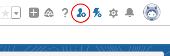

# Salesforce Niknax

Browser extension for various QoL improvements in Salesforce, with emphasis on familiar design and excellent UX.

Features
 - 2-click user creation from anywhere in Salesforce
 - Public Group membership editing from the user detail page
 - Fast Queue membership editing from the user detail page
 - Sleek & familiar SLDS design

Roadmap
 - 🔄 User Cloning
 - 🔄 Bulk Freeze/Unfreeze Users
 - 🔄 Deployment progress bar
 - 🔄 Enhanced debug logs view
 - 🔄 Enhanced API event log viewer
 - 🔄 Edge support

(Not an official Salesforce® product)

## Download

This extension is compatible with: Chrome 88 or later.

## Quick Create User

**Use case**: creating users in a sandbox using only an email

The Quick Create User tool was built to replace the long process of creating a user in a sandbox. 90% of the time you have an email address and you just want to give System Administrator access, this tool drives the population of all the required User fields based on the email and other configurable defaults.

Features
 - Smart auto-population of required User fields
 - Uniquely generated Username/Nickname
 - First/Last name extraction from email
   - Where the format is first.last@domain.com
   - In the case of first.middle.last@domain.com only "first" and "last" are used.
   - In the case of first@domain.com only "first" is put in the Last Name field and the First Name field is kept empty.
 - Automatic Clipboard scan for an email on open
   - Enable in the Settings, re-open the window and grant the Clipboard permission.
   - If no valid email is found, the field will be kept blank.
   - When enabled, you can achieve 2-click user creation!
 - Configurable Username generation
   - Change the domain
 - Configurable Default Profile/Role
 - Available from nearly anywhere in Salesforce!

   

## Public Group/Queue Membership Editing

TODO

## Visuals

    

    

(Click for a video)

## Q&A

**Q**: I can't install the extension because it says "Not Compatible" on Chrome Web Store?

**A**: The extension requires Chrome 88 or later, to make sure you're on the latest Chrome version:
1. At the top right, click the 3 vertical dots.
2. Click Help -> About Google Chrome.
3. Wait for Chrome to download update.
4. Relaunch Chrome.

 

**Q**: What does "Session expired or invalid"/"INVALID_SESSION_ID" mean?

**A**: This is because your session has timed out and you've been logged out of Salesforce. Close all Salesforce Niknax windows, log back into Salesforce and try again.

## Support

Please create an issue using the Bug Report template and provide the information requested in the template.

**If you do not have a GitHub account**, please use the "Support" section on the Chrome Web Store listing.
