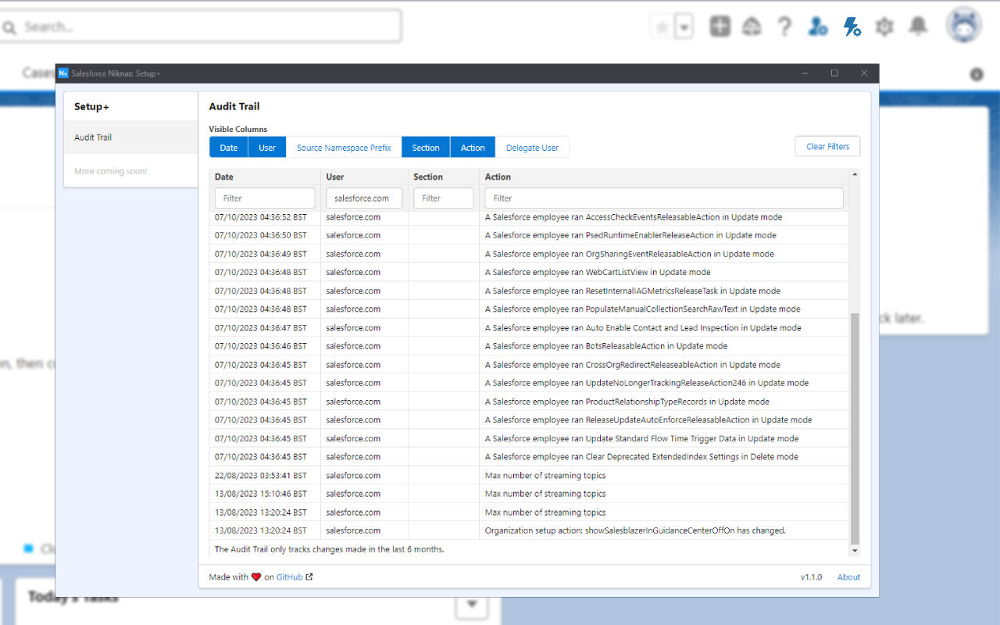

# Salesforce Niknax

Browser extension for various QoL improvements in Salesforce, with emphasis on familiar design and excellent UX.

Features
 - Fast Public Group membership editing
 - Fast Queue membership editing
 - Fast 2-click User creation
 - Fast User Cloning
 - Searchable Audit Trail
 - Sleek & familiar SLDS design

Roadmap
 - 🔄 Bulk Freeze/Unfreeze Users
 - 🔄 Global deployment progress bar
 - 🔄 Enhanced debug logs view
 - 🔄 Enhanced API event log viewer
 - 🔄 Edge support

(Not an official Salesforce® product)

## Download

This extension is compatible with: Chrome 88 or later.

## Contents

- [Quick Create User](#quick-create-user)
  - [User Cloning](#user-cloning)
- [Public Group/Queue Membership Editing](#public-groupqueue-membership-editing)
- [Setup+ Audit Trail](#setup-audit-trail)
- [Video](#video)
- [Q\&A](#qa)
- [Security](#security)
- [Support](#support)

## Quick Create User

**Use case**: creating users in a sandbox using only an email

The Quick Create User tool was built to replace the long process of creating a user in a sandbox. 90% of the time you have an email address and you just want to give System Administrator access, this tool drives the population of all the required User fields based on the email and other configurable defaults.

Features
 - Smart auto-population of required User fields
 - Uniquely generated Username/Nickname
 - First/Last name extraction from email
   - Where the format is first.last@domain.com
   - In the case of first.middle.last@domain.com only "first" and "last" are used.
   - In the case of first@domain.com only "first" is put in the Last Name field and the First Name field is kept empty.
 - Automatic Clipboard scan for an email on open
   - Enable in the Settings, re-open the window and grant the Clipboard permission.
   - If no valid email is found, the field will be kept blank.
   - When enabled, you can achieve 2-click user creation!
 - Configurable Username generation
   - Change the domain
 - Configurable Default Profile/Role
 - Available from nearly anywhere in Salesforce!

 

    

### User Cloning

**Use case**: USE CASE

DESCRIPTION

Features
 - LIST OF FEATURES

 

    

## Public Group/Queue Membership Editing

**Use case**: editing Public Group/Queue memberships from the User detail page

The Public Group/Queue Membership editing tool was built to replace the frustrating process of managing a User's Public Group/Queue membership. Usually, you'd need to navigate to each Public Group/Queue and edit it to include the user.

Instead, a "Edit Memberships" button is now available on the Public Group Memberships and Queue Memberships related lists on the User detail page.

Features
 - Multi-select and Select All
 - Toggle between label or API name
 - Filter by label or API name
 - Match another user's group memberships

 

    

## Audit Trail

**Use case**: USE CASE

DESCRIPTION

Features
 - LIST OF FEATURES

 

    

## Video

## Q&A

**Q**: I can't install the extension because it says "Not Compatible" on Chrome Web Store?

**A**: The extension requires Chrome 88 or later, to make sure you're on the latest Chrome version:
1. At the top right, click the 3 vertical dots.
2. Click Help -> About Google Chrome.
3. Wait for Chrome to download update.
4. Relaunch Chrome.

 

**Q**: What does "Session expired or invalid"/"INVALID_SESSION_ID" mean?

**A**: This is because your session has timed out and you've been logged out of Salesforce. Close all Salesforce Niknax windows, log back into Salesforce and try again.

## Security

This extension has been reviewed by the Chrome Web Store team and follows the [Chrome Web Store Program Policies](https://developer.chrome.com/docs/webstore/program-policies/).

- This extension does not store or transfer data outside of the user's browser or Salesforce org.
- All communication between the extension and Salesforce's REST and Tooling APIs is direct and secured using HTTPS.
  - Verifiable using the "Network" tab in the Chrome developer tools.
- Third-party dependencies are regularly checked for vulnerabilities/updates using `npm audit` and GitHub Dependabot.

## Support

Please create an issue using the Bug Report template and provide the information requested in the template.

**If you do not have a GitHub account**, please use the "Support" section on the Chrome Web Store listing.
